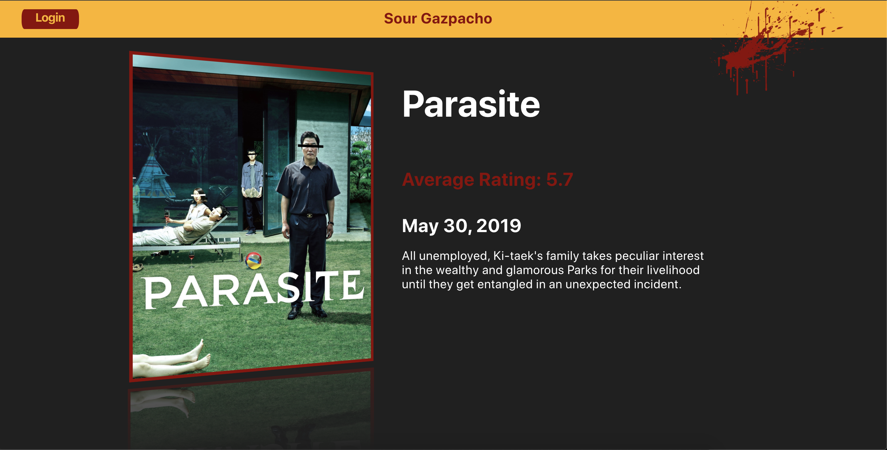

## Sour Gazpacho

Have you ever watched a movie and said to yourself, “Ugh, I wish I could throw a rancid tomatillo at the screen!” Or maybe you loved the movie and you could really go for a nice, fresh tomatillo salsa to enjoy the moment. Well it’s your lucky day.

## Screenshots

### Setup

To run this project pull down this repo and run `npm start`. 
Runs the app in the development mode. 
Open [http://localhost:3000](http://localhost:3000) to view it in the browser.

### Goals

Specific goals of this project were to use the following technologies:
React and Router for dynamic page paths  
Redux  
Sass  
Fetch GET / POST / DELETE Calls to remote API  
Linter  
Jest and Enzyme for Testing Suite  

### Challenges

Some of the challenges faced with this project include using the Redux store with React. Setting up the global data store, deciding what needed to be sent to the store, and which components would need to talk to the store. Extensive testing was also done to ensure accuracy of the functions created.

### Future Iterations

Adding movie trailers to Movie Details  
A user page where they can see all the movies they have rated  
Ability to sort mivies by title, release date, or rating  

### Group Members
John Cassidy [http://github.com/pJanks](github.com/pJanks)
Joel Lacey [http://github.com/joel-oe-lacey](github.com/joel-oe-lacey)
Virginia Ladd [http://github.com/vladd-png](github.com/vladd-png)
